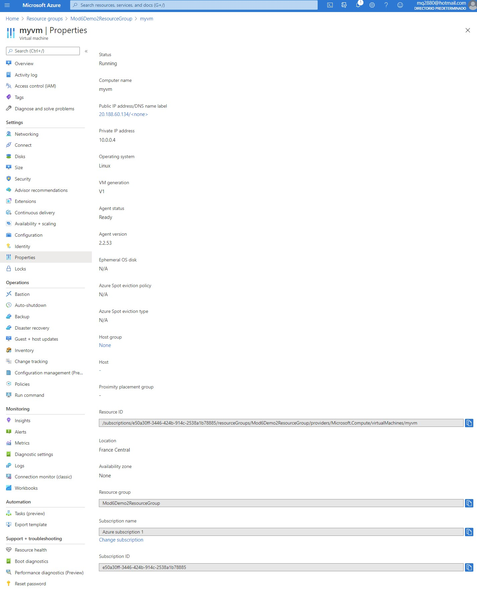
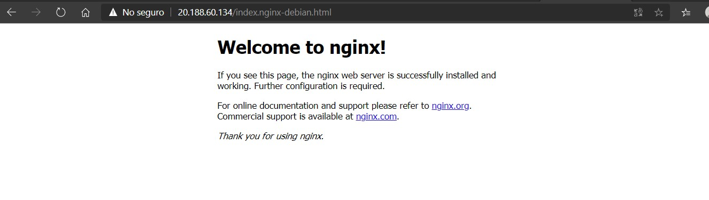
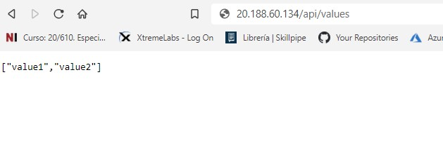

# Module 6: Deploying and Managing Services

# Lesson 2: Web Deployment on Linux

### Demonstration: Deploying an ASP.NET Core Web Service with Nginx

- Creamos una maquina virtual de linux en Azure



- Abrimos el proyecto Demo2Project en VSC

- En el fichero **Demo2Project.csproj**  pegamos la siguiente en el PropertyGroup

  ```xml
  <RuntimeIdentifiers>win10-x64;osx.10.11-x64;ubuntu.16.10-x64</RuntimeIdentifiers>
  ```

- Publicamos la aplicacion como autocontenida para ubuntu

  ```bash
  dotnet publish -c release -r ubuntu.16.10-x64
  ```

- Nos conectamos a la maquina virtual por consola y ejecutamos

  ```bash
  cd /var
  ```

- creamos la carpeta demo

  ```bash
  sudo mkdir demo
  ```

- Cambiamos el propietario

  ```bash
  sudo chown myadmin demo
  ```

- En el pc publicamos a la maquina virtual el paquete autocontenido. Nos pasamos a la carpeta

  ```bash
  cd [Repository Root]\Allfiles\Mod06\Demofiles\Demo2Project\bin\release\netcoreapp2.1
  ```

- publicamos

  ```bash
  scp -r .\ubuntu.16.10-x64\ myadmin@20.188.60.134:/var/demo
  ```

- En maquina virtual ins talamos Nginx

  ```bash
  cd /
  ```

  ```bash
  sudo -s
  nginx=stable
  add-apt-repository ppa:nginx/$nginx
  apt-get update
  apt-get install nginx
  ```

- Arrancamos el servicio **Nginx** 

  ```bash
  sudo service nginx start
  ```

- Verificamos

  ```url
  http://20.188.60.134/index.nginx-debian.html
  ```

  

  

- Abrimos el fichero de configuracion del Nginx

  ```bash
  cd /etc/nginx/sites-available/
  ```

  

  ```bash
  vi default
  ```

- Reemplazamos el contenido de **Location** 

  ```bash
      proxy_pass         http://localhost:5000;
      proxy_http_version 1.1;
      proxy_set_header   Upgrade $http_upgrade;
      proxy_set_header   Connection keep-alive;
      proxy_set_header   Host $host;
      proxy_cache_bypass $http_upgrade;
      proxy_set_header   X-Forwarded-For $proxy_add_x_forwarded_for;
      proxy_set_header   X-Forwarded-Proto $scheme;
  ```

  

- Aplicamos los cambios

  ```bash
  sudo nginx -t
  ```

  ```bash
  sudo nginx -s reload
  ```

  ```bash
  cd /var/demo/ubuntu.16.10-x64/publish/
  ```

- cambiamos los permisos al binario

  ```bash
  chmod a+x ./Demo2Project
  ```

- Ejecutamos la app

  ```bash
  ./Demo2Project
  ```

- Comprobamos

  ```url
  20.188.60.134/api/values
  ```

  

- 